# Fix Finder – Intelligent Testing Assistant

Fix Finder is an AI-powered RAG assistant that analyzes your testing data (Excel/CSV/JSON/TXT/PDF) and answers questions with context-aware, streaming responses.

## Architecture 

```mermaid
graph TB
    %% User Layer
    subgraph "👤 User Layer"
        U[("👨‍💻 QA Engineers<br/>🔍 Testers<br/>📊 Analysts")]
    end
    
    %% Presentation Layer
    subgraph "🖥️ Presentation Layer" 
        subgraph "Frontend SPA"
            UI["🌐 Web Interface<br/>(HTML5/CSS3/ES6+)"]
            CH["💬 Chat Interface<br/>(SSE Streaming)"]
            VZ["📊 Chart.js Visualizations<br/>(Defect Analytics)"]
            FP["📁 File Picker<br/>(webkitdirectory API)"]
        end
        
        subgraph "UI Components"
            HS["📋 Chat History"]
            ST["⚙️ Status Dashboard"] 
            CM["🎨 Chart Manager"]
            DD["📂 Directory Selector"]
        end
    end
    
    %% API Gateway Layer
    subgraph "🚀 API Gateway Layer"
        subgraph "FastAPI Server (v2.0.0)"
            API["🔌 REST API Endpoints<br/>(Port 8000)"]
            MW["🛡️ CORS Middleware"]
            SF["📂 Static File Server"]
        end
        
        subgraph "API Routes"
            QE["/query/stream<br/>(SSE)"]
            IE["/initialize-from-files"]
            AE["/auto-initialize"] 
            SE["/status"]
            RE["/reload"]
        end
    end
    
    %% Business Logic Layer
    subgraph "🧠 Business Logic Layer"
        subgraph "RAG Core Engine"
            RAG["🤖 EnhancedAdaptiveRAGSystem<br/>(Temperature: 0.7)"]
            DM["📊 Document Manager"]
            QP["❓ Query Processor"]
            RM["🔍 Response Manager"]
        end
        
        subgraph "AI/ML Components"
            EMB["🎯 Google Embeddings<br/>(models/embedding-001)"]
            LLM["🧠 Google Gemini LLM<br/>(gemini-2.0-flash)"]
            ST_["🔗 Sentence Transformers<br/>(Local Embeddings)"]
            RR["⚡ CrossEncoder Reranker<br/>(ms-marco-MiniLM)"]
        end
        
        subgraph "Processing Engines"
            PE["📄 PDF Engine<br/>(pdfplumber)"]
            EE["📊 Excel Engine<br/>(openpyxl)"]
            JE["🔧 JSON Engine"]
            TE["📝 Text Engine"]
        end
    end
    
    %% Data Access Layer  
    subgraph "💾 Data Access Layer"
        subgraph "Vector Database"
            VS["🗃️ ChromaDB Vector Store<br/>(Persistent Storage)"]
            EM["🔢 Embedding Matrix"]
            IX["📇 Document Index"]
        end
        
        subgraph "Memory Systems"
            CM_["💭 Chat Memory Store<br/>(./chat_memory)"]
            CS["🧠 Conversation State"]
            CTX["📝 Context Buffer"]
        end
        
        subgraph "Configuration"
            CF["⚙️ ModelConfig<br/>(.env)"]
            SC["📋 Schema Models<br/>(Pydantic)"]
        end
    end
    
    %% Data Sources Layer
    subgraph "📁 Data Sources Layer"
        subgraph "Default Data"
            DD_["📂 ./data Directory"]
            EX["📊 Excel Files (.xlsx)"]
            CS_["📋 CSV Files (.csv)"]
            JS["🔧 JSON Files (.json)"]
            TX["📝 Text Files (.txt)"]
            PF["📄 PDF Files (.pdf)"]
        end
        
        subgraph "Custom Data"
            CD["📁 Custom Directories<br/>(User Selected)"]
            UF["👤 User Files<br/>(Multi-format)"]
        end
        
        subgraph "Sample Data"
            PD["🏭 ProductionDefects.csv"]
            QD["✅ QualityDefects.csv"] 
            ED["🚨 EnterpriseDefects.json"]
            CR["⚠️ CriticalDefects.json"]
        end
    end
    
    %% External Services Layer
    subgraph "🌐 External Services Layer"
        subgraph "Google AI Platform"
            GA["🤖 Google Generative AI<br/>(API Key Auth)"]
            GE["🎯 Google Embeddings API"]
        end
        
        subgraph "HuggingFace Hub"
            HF["🤗 HuggingFace Models<br/>(Token Auth)"]
            ST_M["📦 Sentence Transformer Models"]
        end
        
        subgraph "CDN Services"
            CJS["📊 Chart.js CDN<br/>(v4.5.0)"]
            MIC["🎨 Material Icons CDN"]
            FON["🔤 Google Fonts CDN"]
        end
    end
    
    %% Infrastructure Layer
    subgraph "🏗️ Infrastructure Layer"
        subgraph "Runtime Environment"
            PY["🐍 Python 3.13<br/>(Virtual Env)"]
            UV["⚡ Uvicorn ASGI<br/>(Production Server)"]
        end
        
        subgraph "Storage Systems"
            FS["💾 File System<br/>(Local Storage)"]
            TMP["🗂️ Temporary Storage<br/>(File Processing)"]
            LOG["📝 Logging System<br/>(rag_system_api.log)"]
        end
        
        subgraph "Development Tools"
            GIT["📚 Git Repository"]
            REQ["📦 Requirements.txt"]
            ENV["🔧 Environment Config"]
        end
    end
    
    %% Data Flow Connections
    U --> UI
    UI --> CH
    UI --> VZ
    UI --> FP
    UI --> HS
    UI --> ST
    UI --> CM
    UI --> DD
    
    CH -.->|"HTTP/SSE"| QE
    FP -.->|"POST JSON"| IE
    ST -.->|"GET"| SE
    CM -.->|"Analytics"| API
    
    API --> MW
    API --> SF
    QE --> RAG
    IE --> RAG
    AE --> RAG
    SE --> RAG
    
    RAG --> DM
    RAG --> QP
    RAG --> RM
    RAG --> EMB
    RAG --> LLM
    RAG --> ST_
    RAG --> RR
    
    DM --> PE
    DM --> EE
    DM --> JE
    DM --> TE
    
    RAG --> VS
    RAG --> CM_
    VS --> EM
    VS --> IX
    CM_ --> CS
    CM_ --> CTX
    
    RAG --> CF
    CF --> SC
    
    DM --> DD_
    DD_ --> EX
    DD_ --> CS_
    DD_ --> JS
    DD_ --> TX
    DD_ --> PF
    
    PE -.->|"Extract Text"| PF
    FP --> CD
    CD --> UF
    
    EMB -.->|"API Calls"| GA
    LLM -.->|"API Calls"| GA
    EMB -.->|"Embeddings"| GE
    ST_ -.->|"Models"| HF
    RR -.->|"Models"| ST_M
    
    VZ -.->|"CDN"| CJS
    UI -.->|"CDN"| MIC
    UI -.->|"CDN"| FON
    
    API --> PY
    API --> UV
    RAG --> FS
    DM --> TMP
    RAG --> LOG
    
    %% Color Schemes
    classDef database fill:#e1f5fe,stroke:#01579b,stroke-width:2px,color:#000
    classDef api fill:#e8f5e8,stroke:#2e7d32,stroke-width:2px,color:#000
    classDef frontend fill:#fff3e0,stroke:#e65100,stroke-width:2px,color:#000
    classDef external fill:#f3e5f5,stroke:#4a148c,stroke-width:2px,color:#000
    classDef security fill:#ffebee,stroke:#c62828,stroke-width:2px,color:#000
    classDef ai fill:#e8eaf6,stroke:#3f51b5,stroke-width:2px,color:#000
    classDef infra fill:#f1f8e9,stroke:#33691e,stroke-width:2px,color:#000
    
    %% Apply Classes
    class VS,EM,IX,CM_,CS,CTX database
    class API,MW,SF,QE,IE,AE,SE,RE api
    class UI,CH,VZ,FP,HS,ST,CM,DD frontend
    class GA,GE,HF,ST_M,CJS,MIC,FON external
    class CF,SC security
    class RAG,EMB,LLM,ST_,RR,PE,EE,JE,TE ai
    class PY,UV,FS,TMP,LOG,GIT,REQ,ENV infra
```



## Quick Start

1) Clone and enter the project
```cmd
git clone <repo-url>
cd Ragineer-Test
```

2) Create and activate a virtual environment
```cmd
python -m venv myvenv
myvenv\Scripts\activate
```

3) Install dependencies
```cmd
pip install -r requirements.txt
```

4) Run (starts backend on `http://localhost:8000` and frontend on `http://localhost:3000`)
```cmd
python scripts\run.py
```

5) Add your data
- Place files in `data/` (supported: `.xlsx`, `.xls`, `.csv`, `.json`, `.txt`, `.pdf`).
- Or use the UI’s directory picker to upload a folder (PDF text is auto-extracted).

## Configuration (.env)

Create a `.env` file in the repo root to enable models:
```env
# Required for Google Gemini + Embeddings
GOOGLE_API_KEY=your-google-api-key

# Optional: to speed up SentenceTransformers/CrossEncoder downloads
HUGGINGFACE_TOKEN=your-hf-token
```

Backend is configured for Google models (`gemini-2.0-flash`, `models/embedding-001`). See `config/model_config.py`.

## API Endpoints (FastAPI)

Base URL: `http://localhost:8000`

- `GET /` → Serves the chat UI if `frontend/index.html` exists; otherwise shows API info links.
- `GET /docs` → Interactive Swagger docs.
- `GET /api-info` → API metadata and listed endpoints.

Core
- `GET /status` → System status (models/vector store/files).
- `GET /health` → Health/readiness summary.
- `POST /quick-start?data_directory=data` → Initialize from a local directory (default `data`).
- `POST /auto-initialize?data_source=path` → Initialize from a file or directory.
- `POST /initialize` (JSON body) → Initialize with explicit options.
- `POST /initialize-from-files` (JSON body) → Initialize from files uploaded via the directory picker.
- `POST /reload` → Reload current data source.

Querying
- `POST /query` → Non-streaming answer.
- `POST /query/stream` → Server-Sent Events stream.
- `POST /retrieve` → Retrieve relevant docs and pattern analysis (no LLM answer).

Maintenance
- `POST /rebuild-index` → Rebuild indices.
- `POST /reset-vector-store` → Clear all indexed documents.

Chat memory
- `GET /chat/history?limit=20` → Recent messages and session stats.
- `POST /chat/clear` → Clear current chat session.
- `GET /chat/sessions` → List past sessions.

### Minimal request bodies

`POST /query` and `POST /query/stream`
```json
{ "query": "What are common API testing defects?", "k": 10, "temperature": 0.7 }
```

`POST /initialize`
```json
{
  "excel_file_path": "data",
  "temperature": 0.7,
  "concise_prompt": false,
  "use_sentence_transformers": true,
  "use_reranker": true
}
```

`POST /initialize-from-files` (shape defined in `schema/pydantic_models.py`)
```json
{
  "directory_name": "My Defects Folder",
  "files": [
    {
      "name": "report.xlsx",
      "type": "application/vnd.openxmlformats-officedocument.spreadsheetml.sheet",
      "size": 12345,
      "content": "...",
      "is_binary": false
    }
  ]
}
```

## Notes

- Persistent vector store lives in `db/chroma_db/`; chat memory in `db/chat_memory/`.
- Logs write to `rag_system_api.log`.
- PDF text extraction uses `pdfplumber` (already wired for uploads and local files).
- Frontend is a simple static site in `frontend/` served by Python’s `http.server` (via `scripts/run.py`).

## Troubleshooting

- If the API shows models not ready in `/status`, check your `.env` has a valid `GOOGLE_API_KEY` and restart.
- If no files are loaded, confirm the `data/` directory exists and contains supported formats.
- To reset state, you can call `POST /reset-vector-store` and then re-initialize.

