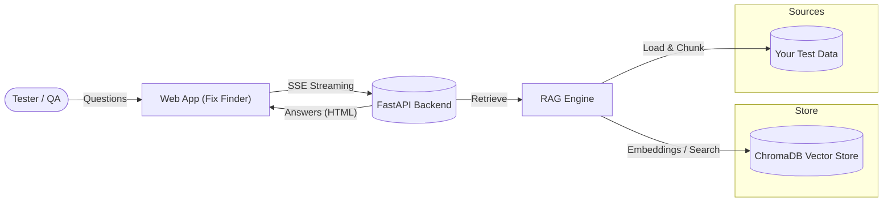
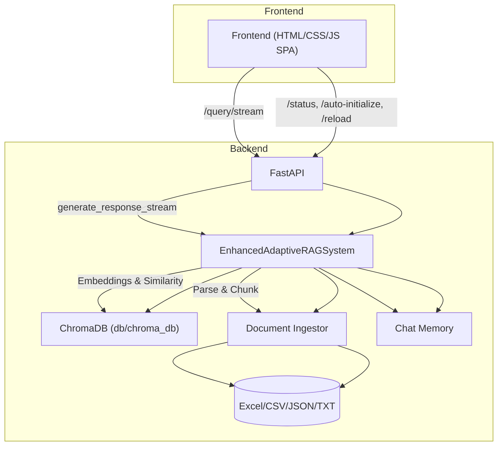
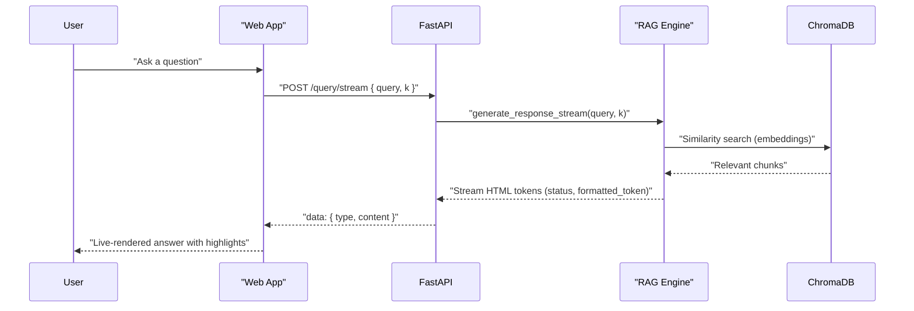

# Fix Finder 3.0 – Intelligent Testing Assistant

Advanced Retrieval-Augmented Generation (RAG) for QA and Testing teams, redesigned for speed, clarity, and reliability.


## Architecture (at a glance)

For everyone: how the pieces talk to each other



What this means in simple terms:
- You ask a question in the browser.
- The backend finds relevant bits from your test documents and crafts an answer.
- You see the response as it streams in, with clear formatting and highlights.


## Technical architecture (Zoomed-in)



Key notes for engineers:
- Streaming via Server-Sent Events; tokens are HTML-formatted for direct rendering.
- Vector storage is persistent via ChromaDB under `db/chroma_db/` (ignored in git).
- Data ingestion supports Excel/CSV/JSON/TXT placed in `data/`.
- Chat sessions persist in the browser (localStorage). Backend has chat memory APIs as well.


## Request flow (simplified sequence)



## Quick Start

1. **Clone Repository**
```cmd
git clone <repo-url>
cd Ragineer-Test
```

2. **Setup Virtual Environment**
```cmd
python -m venv myvenv
myvenv\Scripts\activate
```

3. **Install Dependencies**
```cmd
pip install -r requirements.txt
```

4. **Run (Frontend + Backend together)**
```cmd
python scripts\run.py
```
This starts:
- FastAPI on `http://localhost:8000`
- Frontend on `http://localhost:3000`
Your browser will open automatically.

5. **Add Your Data**
Put testing data files in `data/` folder:
- Excel (.xlsx): JIRA exports, defect reports
- CSV (.csv): TestRail results, bug tracking exports
- JSON (.json): API responses, structured data

6. **Access Application**
Open: `http://localhost:3000`

## Environment Setup (.env)

Create `.env` file in root directory (optional):

```env
# Optional: OpenAI API (if not using default model)
OPENAI_API_KEY=your-openai-api-key

# Optional: Custom configurations  
MODEL_NAME=gpt-3.5-turbo
MAX_DOCUMENTS=10
TEMPERATURE=0.7
```

## Changelog

### v3.0.0 (Current) – UX Refresh + Streaming Reliability
Highlights for teams and engineers

User experience
- New chat hero/welcome with suggestion chips.
- Sidebar “Conversations” with live count, per-chat delete, and export.
- Dark mode with an animated sun/moon toggle next to system status.
- Crisp title, aligned headers, and better toasts/feedback.

Streaming and formatting
- Paragraph-first HTML streaming for clean line breaks.
- Selective emphasis: only key bold phrases (e.g., “high severity”) are tinted.
- Reliable status updates during stream until content starts rendering.

Ops and stability
- One-click auto-initialize and reload data actions from the UI.
- Stronger `/status` polling with progressive messages.
- Project hygiene: robust `.gitignore`, persistent DB directories with `.gitkeep`.

Developer notes
- SSE returns structured events: `status`, `token`, `formatted_token`, `done`, `error`.
- Vector store persistence in `db/chroma_db/` (ignored by git).
- Sessions persist in localStorage; server also exposes chat memory endpoints.

### v2.0.0 – Fix Finder Testing Assistant
Major System Evolution: From Basic RAG to Universal Testing Intelligence

🔄 **Architecture Transformation**
- Migrated from Azure OpenAI + FAISS to ChromaDB vector database for better performance
- Replaced complex hybrid retrieval with streamlined sentence transformers
- Eliminated Cross-Encoder re-ranking for simplified, faster responses
- Transitioned from TailwindCSS to Material Design interface

✨ **Universal Testing Support** 
- Expanded from basic document search to multi-domain testing intelligence
- Support for web, mobile, API, database, performance, and security testing data
- Cross-platform defect analysis and pattern recognition
- Multi-format data ingestion (Excel, CSV, JSON, XML)

🚀 **User Experience Revolution**
- **Complete page refresh issue resolution** - eliminated browser navigation dialogs when pressing Enter
- **Real-time streaming responses** with Server-Sent Events (SSE) instead of static responses  
- **Enhanced loading animations** and intelligent status indicators
- **Comprehensive event handling** overhaul for robust user interactions
- **Production-ready stability** improvements and automatic error recovery

⚡ **Performance & Reliability**
- Optimized HTML chunking algorithm for better streaming performance
- Removed file watching (`--reload` flag) to prevent server interference
- Enhanced response formatting with proper HTML rendering
- Code cleanup and optimization (263+ lines of technical debt removed)
- Robust CORS support for cross-domain deployment

🛠 **System Management**
- One-click "Quick Start" initialization with automatic data discovery
- Real-time system status monitoring with document count tracking
- Improved error handling and recovery mechanisms
- Support for custom data directories and flexible configuration

### v1.0.0 (Initial) - RAGineer Azure RAG System
**Foundation: Advanced Enterprise RAG Platform**

🏗️ **Core Architecture**
- Azure OpenAI integration with GPT models via Azure API
- Hybrid retrieval using Azure OpenAI embeddings + Sentence Transformers
- FAISS vector search with Cross-Encoder re-ranking for precision
- TailwindCSS-based modern web interface with analytics dashboards

🧠 **AI Capabilities**
- Multi-modal retrieval combining Azure OpenAI and local embeddings  
- Cross-Encoder AI re-ranking for highly accurate semantic matches
- Analytical thinking mode for direct Pandas-based data analysis
- Pattern analysis with automatic trend and metric detection

📊 **Analytics Engine**
- Direct data analytics bypass for statistical analysis
- Real-time system monitoring and health checks
- Interactive frontend with analytics visualizations
- Robust logging and error handling systems

🔧 **Technical Foundation**  
- FastAPI backend with comprehensive CORS support
- Support for Excel/CSV data ingestion and processing
- Cloud-ready architecture compatible with Azure and Docker
- Enterprise-grade scalability and deployment options


## API Endpoints

### Core Endpoints

| Endpoint | Method | Description | Example |
|----------|--------|-------------|---------|
| `/status` | GET | Get system status and document count | `GET /status` |
| `/health` | GET | Health check with readiness info | `GET /health` |
| `/quick-start` | POST | Initialize with default data dir | `POST /quick-start?data_directory=data` |
| `/auto-initialize` | POST | Initialize with a custom source | `POST /auto-initialize?data_source=data` |
| `/reload` | POST | Reload currently configured data | `POST /reload` |
| `/query/stream` | POST | Stream real-time responses (SSE) | `POST /query/stream` |
| `/query` | POST | Get complete response (non-streaming) | `POST /query` |
| `/retrieve` | POST | Retrieve relevant documents only | `POST /retrieve` |
| `/rebuild-index` | POST | Rebuild indices if needed | `POST /rebuild-index` |
| `/reset-vector-store` | POST | Clear all indexed documents | `POST /reset-vector-store` |

### Request Examples

#### Streaming Query
```cmd
curl -X POST "http://localhost:8000/query/stream" \
  -H "Content-Type: application/json" \
  -d '{"query": "What are common API testing defects in our system?"}'
```

#### System Status  
```cmd
curl -X GET "http://localhost:8000/status"
```

#### Quick Start with Custom Data
```cmd
curl -X POST "http://localhost:8000/quick-start?data_directory=testing_data"
```

### Response Formats

#### Status Response
```json
{
  "initialized": true,
  "total_documents": 247,
  "document_sources": [
    {"source": "web_defects.xlsx", "count": 89},
    {"source": "mobile_bugs.csv", "count": 67},
    {"source": "api_issues.json", "count": 45},
    {"source": "db_testing.xlsx", "count": 46}
  ],
  "system_ready": true,
  "vector_store_ready": true,
  "llm_ready": true
}
```

#### Streaming Response (SSE)
```
data: {"type": "status", "content": "Retrieving relevant testing documents...", "done": false}
data: {"type": "status", "content": "Found 8 relevant defects across web and API testing. Analyzing patterns...", "done": false}
data: {"type": "formatted_token", "content": "<p><strong>", "done": false}
data: {"type": "formatted_token", "content": "Common Testing Defects Analysis", "done": false}
data: {"type": "formatted_token", "content": "</strong></p>", "done": false}
data: {"type": "done", "content": "", "done": true}
```

### Error Handling

All endpoints return appropriate HTTP status codes:
- `200`: Success
- `400`: Bad Request (invalid parameters)
- `500`: Internal Server Error
- `503`: Service Unavailable (system not initialized)

## Configuration

### Environment Setup

The system uses environment variables for configuration. Create a `.env` file in the root directory:

```env
# Optional: If using OpenAI API instead of default model
OPENAI_API_KEY=your-openai-api-key

# Optional: Custom model configurations
MODEL_NAME=gpt-3.5-turbo
EMBEDDING_MODEL=sentence-transformers/all-MiniLM-L6-v2

# Optional: System configurations
MAX_DOCUMENTS=10
TEMPERATURE=0.7
```

### Data Configuration

The system supports various testing data sources and formats:

**Testing Data Types:**
- **Web Application Defects**: Browser compatibility, UI/UX issues, functionality bugs
- **Mobile Application Issues**: Device-specific problems, performance issues, crashes  
- **API Testing Results**: Endpoint failures, response validation, performance bottlenecks
- **Database Testing Findings**: Data integrity issues, query performance, schema problems
- **Performance Test Results**: Load testing failures, memory leaks, timeout issues
- **Security Testing Reports**: Vulnerabilities, authentication issues, data exposure
- **Integration Testing Issues**: System interface problems, data flow issues

**Supported File Formats:**
```python
# Excel files with structured defect data
SUPPORTED_EXCEL = ['.xlsx', '.xls']

# CSV files from various testing tools  
SUPPORTED_CSV = ['.csv', '.tsv']

# JSON exports from APIs and modern tools
SUPPORTED_JSON = ['.json', '.jsonl']

# XML from legacy systems
SUPPORTED_XML = ['.xml']
```

### System Settings

Default configurations (can be modified in `rag_system.py`):
```python
# Document retrieval settings
DEFAULT_K = 5  # Number of documents to retrieve
MAX_CHUNK_SIZE = 1000  # Maximum chunk size for processing

# Streaming settings
STREAM_DELAY = 0.05  # Delay between streaming tokens (seconds)
STATUS_UPDATE_INTERVAL = 1.0  # Status update frequency

# Vector database settings
COLLECTION_NAME = "testing_defects"  # Universal collection name
SIMILARITY_THRESHOLD = 0.7
CROSS_DOMAIN_SEARCH = True  # Enable search across different testing domains
```


## Tech Stack

### Backend
- **Python 3.11+**: Core programming language
- **FastAPI**: High-performance web framework with automatic API documentation
- **Uvicorn**: ASGI server for production-grade performance
- **ChromaDB**: Vector database for document embeddings and similarity search
- **Sentence Transformers**: State-of-the-art text embeddings
- **LangChain**: LLM framework for retrieval-augmented generation
- **Pandas**: Data manipulation and analysis
- **Pydantic**: Data validation and serialization

### Frontend
- **HTML5/CSS3**: Modern web standards
- **JavaScript (ES6+)**: Interactive functionality and streaming
- **Material Design Icons**: Consistent iconography
- **Server-Sent Events (SSE)**: Real-time streaming communication
- **CSS Grid/Flexbox**: Responsive layout system

### Database & Storage
- **ChromaDB**: Vector embeddings storage and retrieval
- **File System**: Document storage and caching
- **JSON**: Configuration and metadata storage

### Development & Deployment
- **Git**: Version control
- **Python Virtual Environments**: Dependency isolation
- **HTTP Server**: Frontend serving (development)
- **CORS**: Cross-origin resource sharing
- **Logging**: Comprehensive application logging


## Repository Hygiene

What we ignore (so your repo stays lean):
- Virtual envs, caches, and coverage files
- Local logs (e.g., `*.log`, `backend/rag_system_api.log`)
- ChromaDB persistence (`db/chroma_db/**`) and chat memory (`db/chat_memory/**`) – directories kept via `.gitkeep`

Tip: To start fresh, use `scripts\cleanup.py`.


## Contributing

We welcome contributions to Fix Finder! Here's how you can help:

